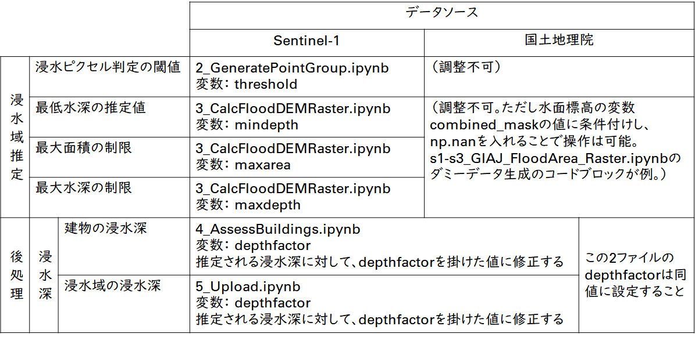
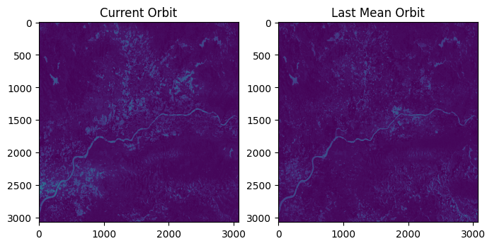
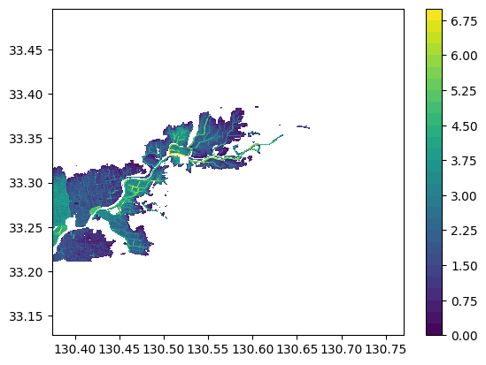
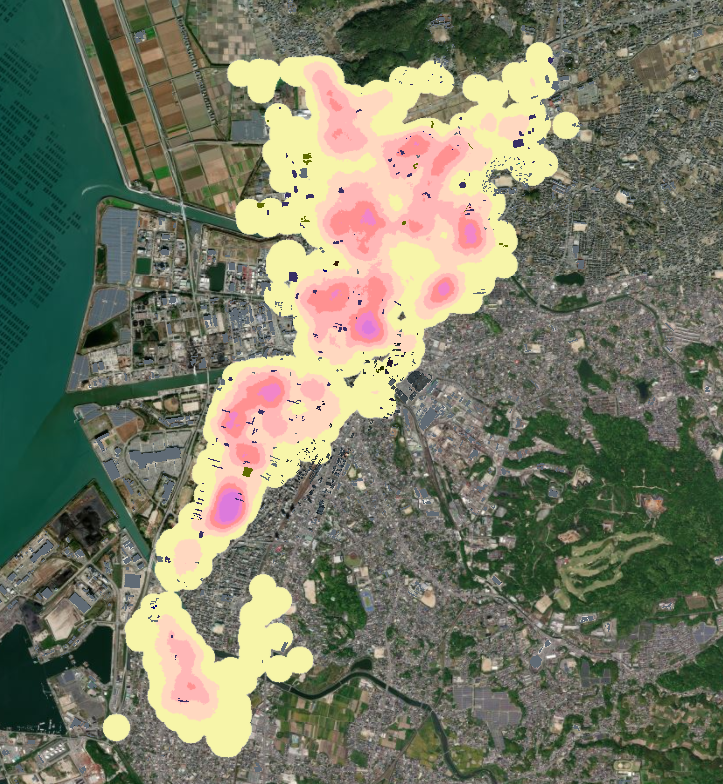

# 操作マニュアル

# 1 本書について

本書では、SAR衛星解析による洪水被害の推定システム（以下「本システム」という。）の操作手順について記載しています。

# 2 使い方

## 2-1 Google Drive内に保存されたファイルの起動

本システムの実行ファイルである拡張子が「.ipynb」のファイルをGoogle Drive内でダブルクリックすると、Google Colaboratoryが起動します。
「マイドライブ」 -> 「SAR-image-based-flood-damage-detector」 -> 「PLATEAU-FloodSAR」に本システムの実行ファイルが展開されています。
以下が実行ファイルの一覧です。欧州宇宙機関が運用するSentinel-1から取得したSAR衛星画像を使用した解析を行う場合、メインブランチを順に実行する。

| ファイル名 |　内容 |　備考 |
|-|-|-|
| 0_PrepareProject.ipynb | プロジェクトの初期・3D都市モデル（CityGML）の読み込み | メインブランチ |
| 1_EstimateSAR-FloodPrbDiff.ipynb | SARデータの読み込み・SARデータによる浸水確率ラスターデータの推定 | メインブランチ |
| 2_GeneratePointGroup.ipynb | 浸水ポイントクラウドデータの生成 | メインブランチ |
| 3_CalcFloodDEMRaster.ipynb | 浸水面の高度ラスターデータと浸水深データの生成 | メインブランチ |
| 4_AssessBuildings.ipynb | 建物への浸水深付与 | メインブランチ |
| 5_Upload.ipynb | Re:Earth CMSへの解析結果のアップロード | メインブランチ |
| s1-s3_GIAJ_FloodArea_Raster.ipynb | GIAJ GeoJSONデータを利用した解析 | サブブランチ |
| s1_ALOS-2_EstimateSAR-FloodPrb.ipynb | ALOS-2データを利用した解析 | サブブランチ |
| s1-s2_ASNARO-2_EstimateSAR_FloodPrb.ipynb | ASNARO-2データを利用した解析 | サブブランチ |

## 2-2 Google Colaboratoryでの実行

① 実行ファイル内の変数設定

・各ファイル内の「設定するパラメータ」セルにある変数を設定してください。
・メインブランチ（Sentinel-1による解析）と国土地理院の浸水エリアのGeoJSONファイルによる解析における解析上のパラメータ変数は以下の通りです。

② すべてのセルの実行

・「ランタイム」ボタンを押下し、「すべてのセルを実行」を選択ことでファイルが実行される。
・Google ColaboratoryによるGoogle Driveへのファイルのアクセス許可を求められるため、許可する。

③ 実行の完了

・すべてのセルの実行が完了したら、次の実行ファイルに進んでください。

## 2-3 各実行ファイルの解説
### 2-3-1 人工衛星観測データの解析（メインブランチ）
#### ⓪プロジェクトの初期・3D都市モデル（CityGML）の読み込み（0_PrepareProject.ipynb）
- 解析対象となるCityGMLと、対象エリアとなる領域の緯度・経度情報またはポリゴンデータを入力することで、CityGMLを解析して、対象エリアの建物データを生成し、日本の地理情報機関からデジタル標高モデル（DEM、5mメッシュ）を事前にダウンロードします。

#### ①SARデータの読み込み・SARデータによる浸水確率ラスターデータの推定（1_EstimateSAR-FloodPrbDiff.ipynb）
- 対象となる洪水日を指定することでその日の人工衛星観測データを、GoogleEarthEngineからSentinel-1の人工衛星観測データを取得し、これを利用して浸水学習モデルを使用して、浸水エリアを分類します。
- 出力は浸水確率ラスターデータであり、洪水時の人工衛星観測データとその前の人工衛星観測データの浸水確率の差を示しています。

#### ②浸水ポイントクラウドデータの生成（2_GeneratePointGroup.ipynb）
- 浸水確率ラスターデータで特定の閾値を超える確率の差があるピクセルを浸水に分類する。その後、ピクセルはグリッドシステムの違いを克服するために点群データを形成する多数のランダムポイントに変換される。

#### ③浸水面の高度ラスターデータと浸水深データの生成（3_CalcFloodDEMRaster.ipynb）
- 浸水ポイントクラウドデータから浸水面の高度ラスターデータと浸水深データを生成します。

#### ④建物への浸水深付与（4_AssessBuildings.ipynb）
- 建物データと浸水面の高度ラスターデータを使用して、建物の被災データ（CSV形式）を生成します。
- 各建物への浸水深は、DEM内の建物の位置と浸水レベルの高低差によって決定される。その後、建物は構造種別と浸水深に基づいて異なる被災カテゴリに分類され、床上浸水か床下浸水かどうかが判定される。

### 2-3-2 解析結果のアップロード（メインブランチ）
#### ⑤Re:Earth CMSへのアップロード（5_Upload.ipynb）
- 前項目で生成したデータを読み込み、データをRe:Earth CMSにアップロードします。
- ここでは、Re:Earth CMSとの認証が必要となります。

###  2-3-3 GIAJ浸水エリアのGeoJSONファイルの分析（サブシーケンス）
#### GIAJ GeoJSONから浸水面の高度ラスターデータの生成（s1-s3_GIAJ_FloodArea_Raster.ipynb）
- ローカルに保存されたJSONファイルで動作します。
- GIAJ GeoJsonから洪水面高度ラスターデータを生成します。
- メインステップ①〜③を代替します。
- このファイルを実行した後、メインステップ④で続行してください。

###  2-3-4 ALOS-2の分析（サブシーケンス）
#### ALOS-2の分析（s1_ALOS-2_EstimateSAR-FloodPrb.ipynb）
- ローカルに保存されたGeoTIFFファイルで動作します。ローカルのALOS-2 SARデータをGoogle Driveにアップロードし、tiff_pathの場所を指定してください。
- メインステップ①を代替します。
- このファイルを実行した後、メインステップ②で続行してください。
- 注意: このファイルはプロトタイプであるため、対象エリアはローカルのSAR TIFFファイルに含まれている必要があります。
- データを見つけるヒントについてはFindSARofJapan.mdを読んでください。

###  2-3-5 ASNARO-2の分析（サブシーケンス）
#### ASNARO-2の分析（s1-s2_ASNARO-2_EstimateSAR_FloodPrb.ipynb）
- ローカルに保存されたGeoTIFFファイルで動作します。
- メインステップ①～②を代替します。
- このファイルを実行した後、メインステップ③で続行してください。

# 3 出力データ

解析で出力されるデータは以下のとおりです。

| 機能                     | 出力データ                               | 内容                                                                                                   | データ形式 |
| ------------------------ | ---------------------------------------- | ------------------------------------------------------------------------------------------------------ | ---------- |
| 人工衛星観測データの解析 | 建物被災状況　                           | 入力したCityGMLの属性をパースし、解析結果の浸水深、被災カテゴリを属性として付与したデータ。            | CSV        |
|                          | 浸水域・浸水深の画像タイル               | 解析結果の浸水域と浸水深を画像タイル化したデータ。                                                     | png        |
|                          | 浸水域・浸水深の3D点群データ             | 解析結果の浸水域と浸水深を3D点群化したデータ。                                                         | 3DTiles    |
|                          | 被災建物のヒートマップ画像タイル         | 木造建物に対して床上浸水、床下浸水、木造家屋総数のヒートマップを画像タイル化したデータ。           | png        |

## 3-1 建物被災状況

建物被災状況は建築物モデルの属性に付与され、入力したCityGMLの建物IDに紐づいてCSV形式で出力されます。

## 3-2 浸水域・浸水深の画像タイル

浸水域・浸水深の画像タイルはpng形式で出力されます。

画像ファイルに位置情報が付与されているため、GISソフト（QGISやArcGIS等）で利用可能です。

## 3-3 浸水域・浸水深の3D点群データ

浸水域・浸水深の3D点群データは3DTilesで出力されます。

## 3-4 被災建物のヒートマップ画像タイル

被災建物のヒートマップ画像タイルはpng形式で出力されます。

色の閾値は、「4_AssessBuildings.ipynb」のXYZタイル分けされた点郡NPZファイルの生成関数において変更が可能となっています。

画像ファイルに位置情報が付与されているため、GISソフト（QGISやArcGIS等）で利用可能です。

